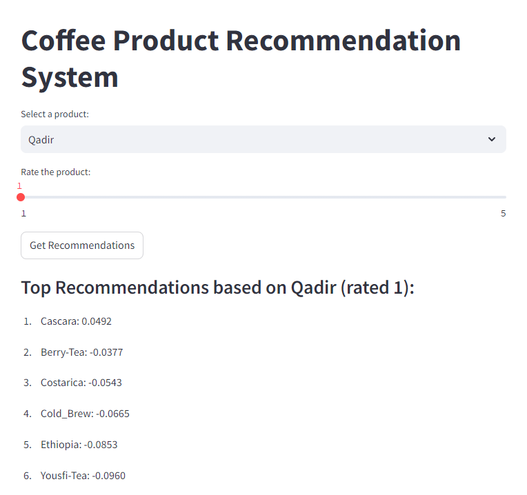
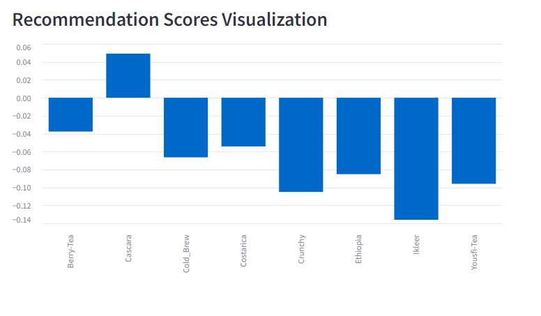

# Coffee Product Recommendation System

## Overview
This project implements a recommendation system for a local coffee shop, Assin Cafe in Medina. It aims to provide instant product recommendations to customers, mimicking the role of experienced cashiers in suggesting coffee products.

## Problem Statement
The cafe owner noticed that customers trust and appreciate recommendations from cashiers. However, cashier performance can be inconsistent due to various factors. This system provides a consistent, data-driven approach to product recommendations.

## Features
- Instant product recommendations based on sales history
- User-friendly Streamlit interface
- Visualization of recommendation scores
- Customizable rating input for selected products

## Demo
Here are some screenshots of the application in action:


*Figure 1: Main interface of the Coffee Product Recommendation System*


*Figure 2: Recommendation results and visualization*

## Technical Details
- **Language**: Python
- **Main Libraries**: 
  - Streamlit for the web interface
  - Pandas for data manipulation
  - SciPy for sparse matrix operations
  - Scikit-learn for cosine similarity calculations
- **Recommendation Algorithm**: Collaborative filtering using cosine similarity

## File Structure
- `app.py`: Main application file containing the Streamlit interface and recommendation logic
- `rating_data_modified.xlsx`: Dataset with product ratings
- `main.ipynb`: (Not provided in the repository, but mentioned in the image) Possibly contains data preprocessing or model development steps
- `demo1.png`: Screenshot of the main interface
- `demo2.png`: Screenshot of recommendation results and visualization

## How It Works
1. The system loads and standardizes product rating data.
2. It creates a correlation matrix using cosine similarity.
3. Users select a product and provide a rating through the Streamlit interface.
4. The system generates recommendations based on the selected product and rating.
5. Top recommendations are displayed along with a visualization of recommendation scores.

## Setup and Running
1. Install required packages:
   ```
   pip install streamlit pandas scipy scikit-learn openpyxl
   ```
2. Run the Streamlit app:
   ```
   streamlit run app.py
   ```

## Future Improvements
- Incorporate user history for personalized recommendations
- Expand the dataset with more products and ratings
- Implement A/B testing to compare system performance with human cashier recommendations

## Contributors
- mdnaseif (GitHub username)

## License
[Add appropriate license information here]

---

This project demonstrates the potential of AI in enhancing small business operations, specifically in the context of a local coffee shop. It serves as a proof of concept for AI applications in small-scale retail environments.
